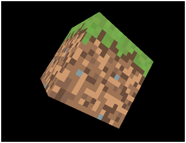

# 纹理（Textures）

## 创建一个三维立方体

在本章中，我们将学习如何在渲染中加载纹理并使用它们。为了讲解与纹理相关的所有概念，我们将把之前章节中使用的正方形更改为三维立方体。为了绘制一个立方体，我们只需要正确地设置一个立方体的坐标，就能使用现有代码正确地绘制它。

为了绘制立方体，我们只需要定义八个顶点。


因此，它的坐标数组将是这样的：

```java
float[] positions = new float[] {
    // VO
    -0.5f,  0.5f,  0.5f,
    // V1
    -0.5f, -0.5f,  0.5f,
    // V2
    0.5f, -0.5f,  0.5f,
    // V3
     0.5f,  0.5f,  0.5f,
    // V4
    -0.5f,  0.5f, -0.5f,
    // V5
     0.5f,  0.5f, -0.5f,
    // V6
    -0.5f, -0.5f, -0.5f,
    // V7
     0.5f, -0.5f, -0.5f,
};
```

当然，由于我们多了4个顶点，我们需要更改颜色数组。当前仅重复前四项的值。

```java
float[] colours = new float[]{
    0.5f, 0.0f, 0.0f,
    0.0f, 0.5f, 0.0f,
    0.0f, 0.0f, 0.5f,
    0.0f, 0.5f, 0.5f,
    0.5f, 0.0f, 0.0f,
    0.0f, 0.5f, 0.0f,
    0.0f, 0.0f, 0.5f,
    0.0f, 0.5f, 0.5f,
};
```

最后，由于立方体是六个面构成的，所以需要绘制十二个三角形（每个面两个），所以我们需要更改索引数组。记住三角形必须按逆时针顺序定义。如果你徒手做这件事，很容易犯错。一定要将你想定义的面摆在你的面前，确认顶点并以逆时针顺序绘制三角形。

```java
int[] indices = new int[] {
    // Front face
    0, 1, 3, 3, 1, 2,
    // Top Face
    4, 0, 3, 5, 4, 3,
    // Right face
    3, 2, 7, 5, 3, 7,
    // Left face
    6, 1, 0, 6, 0, 4,
    // Bottom face
    2, 1, 6, 2, 6, 7,
    // Back face
    7, 6, 4, 7, 4, 5,
};
```

为了更好的观察立方体，我们将更改'DummyGame'类中旋转模型的代码，使它沿着三个轴旋转。

```java
// Update rotation angle
float rotation = gameItem.getRotation().x + 1.5f;
if ( rotation > 360 ) {
    rotation = 0;
}
gameItem.setRotation(rotation, rotation, rotation);
```

就这样，现在能够显示一个旋转的三维立方体了。现在你可以编译和运行示例代码，会得到如下所示的东西。


这个立方体有些奇怪。有些面没有被正确的绘制。发生了什么？立方体出现这个现象的原因，是组成立方体的三角形是以一种随即顺序绘制的。事实上距离较远的像素应该在距离较近的像素之前绘制，而不是现在这样。为了做到这一点，我们必须启用深度测试(`Depth Test`)。

这可以在`Window`类的`init`方法中做到：

```java
glEnable(GL_DEPTH_TEST);
```

现在立方体被正确地渲染了！


如果你看了本章这一小节的代码，你可能会看到`Mesh`类做了一次小规模的调整。VBO的ID现在被储存在一个List中，以方便地迭代它们。

## 为立方体添加纹理

现在我们将把纹理应用到立方体上。纹理是用来绘制某个模型的像素的颜色的图像，可以认为纹理是包裹在3D模型周围的皮肤。你要做的就是将纹理图像中的点分配给模型中的顶点。这样，OpenGL能够根据纹理图像计算其他像素的颜色。


纹理图像不需要与模型同样大小，它可以变大或变小。如果要处理的像素不能映射到纹理中的特定点，OpenGL将推断颜色。当创建纹理时，可以控制此过程。

因此，为了将纹理应用到模型，我们必须做的是将纹理坐标分配给每个顶点。纹理坐标系有些不同于模型坐标系。首先，我们的纹理是二维纹理，所以坐标只有X和Y两个量。此外，原点是图像的左上角，X或Y的最大值都是1。


我们如何将纹理坐标与位置坐标联系起来呢？简单，就像传递颜色信息一样。我们创建了一个VBO，将为每个顶点储存纹理坐标。

让我们为在三维立方体中应用纹理来修改代码吧。第一步是加载将被用作纹理的图像。对于这件事，在之前版本的LWJGL中，通常使用Slick2D库。在撰写本文的时候，这个库似乎与LWJGL 3不兼容，所以需要使用更冗长的方法。我们将使用一个名为`pngdecoder`的库，因此，需要在`pom.xml`文件中声明依赖。

```xml
<dependency>
    <groupId>org.l33tlabs.twl</groupId>
    <artifactId>pngdecoder</artifactId>
    <version>${pngdecoder.version}</version>
</dependency>
```

然后设置库使用的版本。

```xml
<properties>
    [...]
    <pngdecoder.version>1.0</pngdecoder.version>
    [...]
</properties>
```

在一些教程中你可能看到，必须做的第一件事是调用`glEnable(GL_TEXTURE_2D)`来启用OpenGL的纹理功能。如果使用固定函数关系，这是正确的。但我们使用的是GLSL着色器，因此不再需要了。

现在我们将创建一个新的`Texture`类，它将进行所有必要的步骤以加载纹理。纹理图像将位于`resources`文件夹中，可以作为CLASSPATH资源访问并使用输入流传递到`PNGDecoder`类。

```java
PNGDecoder decoder = new PNGDecoder(
     Texture.class.getResourceAsStream(fileName));
```

然后，我们需要解码PNG图像，并通过`PNGDecoder`的`decode`方法将其内容储存到缓冲区中。PNG图像以RGBA(RGB意为红绿蓝，A意为Alpha或透明度)格式解码，每个像素使用四个字节。

`decode`方法需要三个参数：

* `buffer`: 储存解码后图像的`ByteBuffer`(因为每个像素是四个字节，其大小将是4\*宽度\*高度)。
* `stride`: 指定从一行开始到下一行的起始字节的距离。现在它是每行的字节数。
* `format`: 图像解码的目标格式(RGBA)。

```java
ByteBuffer buf = ByteBuffer.allocateDirect(
    4 * decoder.getWidth() * decoder.getHeight());
decoder.decode(buf, decoder.getWidth() * 4, Format.RGBA);
buf.flip();
```

一件关于OpenGL的重要事情，由于历史原因，要求纹理图像的大小(每个轴的像素数)必须是二的指数(2, 4, 8, 16, ....)。一些驱动消除了这种限制，但最好还是坚持以免出现问题。

下一步是将纹理传递到显存中。首先，我们需要创建一个新的纹理ID。与该纹理相关的操作都要使用该ID，因此我们需要绑定它。

```java
// Create a new OpenGL texture 
int textureId = glGenTextures();
// Bind the texture
glBindTexture(GL_TEXTURE_2D, textureId);
```

然后需要告诉OpenGL如何解包我们的RGBA字节。由于每个数据大小都是一个字节，所以我们需要添加以下代码：

```java
glPixelStorei(GL_UNPACK_ALIGNMENT, 1);
```

最后我们可以传递材质数据：

```java
glTexImage2D(GL_TEXTURE_2D, 0, GL_RGBA, decoder.getWidth(),
    decoder.getHeight(), 0, GL_RGBA, GL_UNSIGNED_BYTE, buf);
```

`glTexImage2D`的参数如下：

* `target`: 指定目标纹理(纹理类型)。现在是`GL_TEXTURE_2D`。
* `level`: 指定纹理细节的等级。0级是基本图像等级。第n级是第n个多级渐远纹理(`Mipmap`)的图像。之后再谈这个问题。
* `internal format`: 指定纹理中颜色分量的数量。
* `width`: 指定纹理图像的宽度。
* `height`: 指定纹理图像的高度。
* `border`: 此值必须为0。
* `format`: 指定像素数据的格式，现在为RGBA。
* `type`: 指定像素数据的类型。现在，我们使用的是无符号字节。
* `data`: 储存数据的缓冲区。

在一些代码片段中，你可能会发现在调用`glTexImage2D`方法钱设置了一些过滤参数。过滤是指在缩放时如何绘制图像，以及如何修改像素。

如果没有设置这些参数，纹理将不会显示。因此，在`glTexImage2D`方法调用之前，你会看到如下代码：

```java
glTexParameteri(GL_TEXTURE_2D, GL_TEXTURE_MIN_FILTER, GL_NEAREST);
glTexParameteri(GL_TEXTURE_2D, GL_TEXTURE_MAG_FILTER, GL_NEAREST);
```

这些参数基本上在表达，当一个像素与纹理坐标没有直接的一对一关联时，它将选择最近的纹理坐标点。

到目前为止，我们不会设置这些参数。相反，我们将生成一个多级渐远纹理(`Mipmap`)。多级渐远纹理是由高细节纹理生成的逐级降低分辨率的纹理集合。当我们的物体缩放时，就将自动使用低分辨率的图像。

为了生成多级渐远纹理，我们只需要编写以下代码(现在，我们把它放在`glTextImage2D`方法调用之后)：

```java
glGenerateMipmap(GL_TEXTURE_2D);
```

就这样，我们已经成功地加载了纹理，现在需要使用它。正如之前所说的，我们需要把纹理坐标作为另一个VBO。因此，我们将修改`Mesh`类来接收浮点数组，其中储存纹理坐标，而不是颜色(我们可以同时有颜色和纹理，但为了简化它，我们将删除颜色)。构造函数现在是这样的：

```java
public Mesh(float[] positions, float[] textCoords, int[] indices,
    Texture texture)
```

纹理坐标VBO与颜色VBO创建的方式相同。唯一的区别是它有两个元素而不是三个：

```java
vboId = glGenBuffers();
vboIdList.add(vboId);
textCoordsBuffer = MemoryUtil.memAllocFloat(textCoords.length);
textCoordsBuffer.put(textCoords).flip();
glBindBuffer(GL_ARRAY_BUFFER, vboId);
glBufferData(GL_ARRAY_BUFFER, textCoordsBuffer, GL_STATIC_DRAW);
glVertexAttribPointer(1, 2, GL_FLOAT, false, 0, 0);
```

现在我们需要在着色器中使用这些纹理。在顶点着色器中，第二个Uniform被修改了，因为现在它是一个`vec2`(也顺便更改了名称，所以记得在`Renderer`类中更改它)。顶点着色器就像之前一样，仅仅传递纹理坐标给片元着色器。

```glsl
#version 330

layout (location=0) in vec3 position;
layout (location=1) in vec2 texCoord;

out vec2 outTexCoord;

uniform mat4 worldMatrix;
uniform mat4 projectionMatrix;

void main()
{
    gl_Position = projectionMatrix * worldMatrix * vec4(position, 1.0);
    outTexCoord = texCoord;
}
```

在片元着色器中，我们使用那些纹理坐标来设置像素颜色：

```glsl
#version 330

in  vec2 outTexCoord;
out vec4 fragColor;

uniform sampler2D texture_sampler;

void main()
{
    fragColor = texture(texture_sampler, outTexCoord);
}
```

在分析代码之前，让我们理清一些概念。显卡有几个空间或槽来储存纹理。每一个空间被称为纹理单元(`Texture Unit`)。当使用纹理时，我们必须设置想用的纹理。正如你所看到的，我们有一个新的名为`texture_sampler`的Uniform。该Uniform是`sampler2D`，并储存有我们希望使用的纹理单元的值。

在`main`函数中，我们使用`texture`函数来使用纹理。这个函数有两个参数：取样器(`Sampler`)和纹理坐标，并返回正确的颜色。取样器Uniform允许使用多重纹理(`multi-texture`)，不过现在不是讨论这个话题的时候，但是我们会在稍后再尝试添加。

因此，在`ShaderProgram`类中，我们将创建一个新的方法，允许为整数型Uniform设置数值：

```java
public void setUniform(String uniformName, int value) {
    glUniform1i(uniforms.get(uniformName), value);
}
```

在`Renderer`类的`init`方法中，我们将创建一个新的Uniform：

```java
shaderProgram.createUniform("texture_sampler");
```

此外，在`Renderer`类的`render`方法中，我们将Uniform的值设置为0(我们现在不使用多个纹理，所以只使用单元0)。

```java
shaderProgram.setUniform("texture_sampler", 0);
```

最好，我们只需改变`Mesh`类的渲染方法就可以使用纹理。在方法开始的地方，我们添加以下几行代码：

```java
// Activate first texture unit
glActiveTexture(GL_TEXTURE0);
// Bind the texture
glBindTexture(GL_TEXTURE_2D, texture.getId());
```

我们基本上将`texture.getId()`所获得的纹理绑定到纹理单元0上。

现在，我们刚刚修改了代码来支持纹理。现在我们需要为三维立方体设置纹理坐标。我们的纹理图像文件将是这样的：


在我们的3D模型中，一共有八个顶点。我们首先定义每个顶点的正面纹理坐标。


| Vertex | Texture Coordinate |
| --- | --- |
| V0 | \(0.0, 0.0\) |
| V1 | \(0.0, 0.5\) |
| V2 | \(0.5, 0.5\) |
| V3 | \(0.5, 0.0\) |

然后，定义顶面纹理的映射。


| Vertex | Texture Coordinate |
| --- | --- |
| V4 | \(0.0, 0.5\) |
| V5 | \(0.5, 0.5\) |
| V0 | \(0.0, 1.0\) |
| V3 | \(0.5, 1.0\) |

正如你所看到的，有一个问题，我们需要为同一个顶点(V0和V3)设置不同的纹理坐标。怎么样才能解决这个问题呢？解决这一问题的唯一方法是重复一些顶点并关联不同的纹理坐标。对于顶面，我们需要重复四个顶点并为它们分配正确的纹理坐标。

因为前面、后面和侧面都使用相同的纹理，所以我们不需要重复这些顶点。在源代码中有完整的定义，但是我们需要从第8章跳到第20章了。最终的结果就像这样。



在接下来的章节中，我们将学习如何加载由3D建模工具生成的模型，这样我们就不需要手动定义顶点和纹理坐标了(顺便一提，对于更复杂的模型，手动定义是不存在的)。

